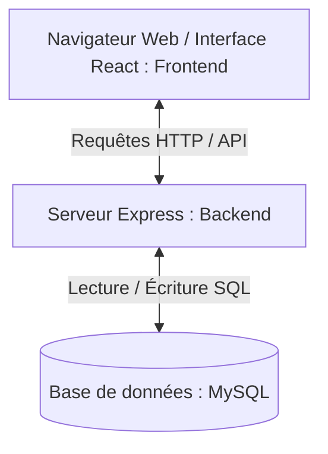

# 📘 Guide d'Installation et de Démarrage pour Débutants : Casa Boutique

Ce guide est conçu spécifiquement pour vous aider à installer, configurer et exécuter l'application **Casa Boutique** sur votre ordinateur, même si vous n'avez jamais utilisé **Node.js**, **React** ou **MySQL** auparavant. 

Suivez les étapes dans l'ordre, pas à pas.

---

## 🛠️ Partie 1 : Introduction et Fonctionnement Global

Avant de commencer à installer les outils, comprenons comment fonctionne l'application. Casa Boutique est composée de deux parties distinctes qui communiquent entre elles :



1. **Le Frontend (React)** : C'est la partie "visible" de l'application. Elle s'exécute dans votre navigateur (Google Chrome, Safari, Firefox). C'est ici que l'utilisateur clique sur les produits, gère son panier et paie ses commandes.
2. **Le Backend (Node.js + Express)** : C'est le "cerveau" invisible. Il s'exécute sur votre machine en tant que serveur. Il reçoit les demandes du frontend (ex: *"Donne-moi la liste des produits"* ou *"Vérifie les identifiants de connexion"*), interroge la base de données et renvoie la réponse.
3. **La Base de Données (MySQL)** : C'est la mémoire de l'application. Elle stocke toutes les informations de manière permanente (les utilisateurs, les produits, les commandes, les fournisseurs).

---

## 💻 Partie 2 : Les Prérequis Absolute (À installer en premier)

Pour faire tourner le projet, vous devez installer **trois outils gratuits** sur votre ordinateur.

### 1. Installer Node.js
Node.js est l'environnement qui permet d'exécuter du code JavaScript en dehors du navigateur (notamment pour faire tourner le backend).
* **Comment faire** :
  1. Allez sur le site officiel : [nodejs.org](https://nodejs.org/).
  2. Téléchargez la version recommandée pour la plupart des utilisateurs (indiquée **LTS**, par exemple `v18.x` ou `v20.x`).
  3. Lancez l'installateur téléchargé et laissez toutes les options par défaut en cliquant sur *Suivant/Next*.
  4. **Vérification** : Ouvrez votre terminal (sur Mac : l'application *Terminal*, sur Windows : *Invite de commandes* ou *PowerShell*) et tapez les commandes suivantes :
     ```bash
     node -v
     npm -v
     ```
     *Si ces commandes affichent un numéro de version (ex: `v20.9.0`), Node.js est correctement installé.*

### 2. Installer un Serveur MySQL
La base de données MySQL doit être installée pour stocker vos données.
* **Option A (Recommandée pour débutants sous Windows/Mac)** : Installer **XAMPP**.
  1. Téléchargez XAMPP depuis [apachefriends.org](https://www.apachefriends.org/).
  2. C'est un logiciel qui installe à la fois Apache et MySQL en un clic.
  3. Une fois installé, ouvrez le "XAMPP Control Panel" et cliquez sur le bouton **Start** à côté de **MySQL**.
* **Option B** : Installer **MySQL Community Server** directement depuis le site officiel de MySQL.
* **Option C (Pour Mac)** : Si vous avez Homebrew installé, vous pouvez lancer `brew install mysql` et `brew services start mysql`.

### 3. Installer un Éditeur de Code (Recommandé)
Pour visualiser et modifier le code, téléchargez **Visual Studio Code (VS Code)** :
* Allez sur [code.visualstudio.com](https://code.visualstudio.com/) et téléchargez-le.

---

## 🗄️ Partie 3 : Initialisation de la Base de Données

Une fois votre serveur MySQL démarré, vous devez importer la structure de la base de données du projet Casa Boutique.

1. **Trouver le fichier SQL** : Le projet contient un fichier de schéma de base de données situé à l'adresse suivante : [database.sql](file:///Users/macbook/Documents/casaboutique/backend/database.sql) (ou dans `backend/database.sql`).
2. **Créer et importer la base de données** :
   * **Méthode graphique (PhpMyAdmin de XAMPP)** :
     1. Ouvrez votre navigateur et allez sur `http://localhost/phpmyadmin`.
     2. Cliquez sur l'onglet **Importer** en haut.
     3. Cliquez sur **Choisir un fichier** et sélectionnez le fichier `database.sql` situé dans le dossier `backend` de votre projet.
     4. Cliquez sur **Importer** (ou **Go**) tout en bas de la page.
     5. *Cela va automatiquement créer la base de données `casa_boutique` et toutes les tables nécessaires.*
   * **Méthode en ligne de commande (Terminal)** :
     Ouvrez votre terminal et exécutez la commande suivante (appuyez sur Entrée si vous n'avez pas défini de mot de passe) :
     ```bash
     mysql -u root -p < /Users/macbook/Documents/casaboutique/backend/database.sql
     ```

---

## ⚙️ Partie 4 : Démarrage du Backend (Serveur Node.js)

Le backend gère la logique métier et l'accès aux données.

### Étape 1 : Ouvrir le terminal dans le bon dossier
Ouvrez votre terminal et placez-vous dans le dossier `backend` du projet en tapant :
```bash
cd /Users/macbook/Documents/casaboutique/backend
```

### Étape 2 : Installer les dépendances
Les dépendances sont des bibliothèques de code pré-écrites dont le projet a besoin pour fonctionner (définies dans [package.json](file:///Users/macbook/Documents/casaboutique/backend/package.json)).
Exécutez la commande suivante :
```bash
npm install
```
*Cette commande va créer un dossier `node_modules` dans le dossier `backend` et y télécharger toutes les librairies nécessaires.*

### Étape 3 : Configurer le fichier d'environnement (`.env`)
Le fichier `.env` contient les configurations sensibles de votre application (mots de passe, clés secrètes).
1. Vérifiez s'il y a déjà un fichier `.env` ou créez-en un à partir du modèle :
   * Si le fichier `.env` n'existe pas, dupliquez `.env.example` et renommez-le en `.env`.
2. Ouvrez le fichier `.env` du backend et configurez les informations de connexion à votre base de données MySQL :
   ```env
   # Paramètres de connexion à MySQL
   DB_HOST=localhost
   DB_USER=root
   DB_PASSWORD=             # Laissez vide si vous utilisez XAMPP sans mot de passe, ou mettez votre mot de passe MySQL
   DB_NAME=casa_boutique
   
   # Configuration du serveur
   PORT=5000
   NODE_ENV=development
   
   # Clé secrète pour le chiffrement des connexions utilisateur (mettez ce que vous voulez)
   JWT_SECRET=ma_super_cle_secrete_123!
   ```

### Étape 4 : Lancer le serveur backend
Dans le terminal où vous êtes dans le dossier `backend`, exécutez :
```bash
npm run dev
```
* **Pourquoi `dev` ?** : Cette commande utilise l'utilitaire `nodemon` qui redémarre automatiquement le serveur à chaque fois que vous modifiez un fichier de code.
* **Résultat attendu** : Vous devriez voir un message indiquant :
  `Server is running on port 5000` et `Database connected successfully`.

> [!TIP]
> Pour tester que le serveur backend fonctionne bien, ouvrez votre navigateur et allez sur `http://localhost:5000/api/products`. Si vous voyez du texte au format JSON s'afficher, c'est parfait !

---

## 🎨 Partie 5 : Démarrage du Frontend (Interface React)

Le frontend fournit l'interface visuelle avec laquelle l'utilisateur interagit.

### Étape 1 : Ouvrir un NOUVEAU terminal
> [!IMPORTANT]
> Ne fermez pas le terminal du backend ! Laissez-le tourner. Ouvrez un nouvel onglet ou une nouvelle fenêtre de terminal pour lancer le frontend.

### Étape 2 : Se déplacer dans le dossier frontend
Dans ce nouveau terminal, tapez :
```bash
cd /Users/macbook/Documents/casaboutique/frontend
```

### Étape 3 : Installer les dépendances du frontend
Installez les bibliothèques d'interface (React, Tailwind CSS, etc.) :
```bash
npm install
```

### Étape 4 : Configurer le fichier d'environnement du frontend
Le frontend doit savoir où se trouve le backend pour lui envoyer des requêtes.
1. Ouvrez le fichier `.env` situé dans le dossier `frontend`.
2. Assurez-vous qu'il contient la ligne suivante :
   ```env
   REACT_APP_API_URL=http://localhost:5000/api
   ```
   *(Cela indique à React de communiquer avec le serveur Node.js lancé sur le port 5000).*

### Étape 5 : Lancer le serveur de développement React
Dans votre terminal (dossier `frontend`), exécutez :
```bash
npm start
```
* **Résultat attendu** : Votre navigateur web par défaut devrait s'ouvrir automatiquement sur `http://localhost:3000`. Vous verrez alors l'interface magnifique de l'application e-commerce **Casa Boutique**.

---

## 📁 Partie 6 : Anatomie du Projet (Qu'est-ce qu'il y a dedans ?)

Voici une explication de la structure du code pour s'y retrouver facilement :

### 1. Le dossier `backend/`
* `server.js` : Le point d'entrée principal. Il démarre le serveur Express, configure la sécurité (CORS) et branche les différentes routes de l'API.
* `routes/` : Contient des fichiers JavaScript thématiques qui définissent les URLs disponibles (endpoints) :
  * [auth.js](file:///Users/macbook/Documents/casaboutique/backend/routes/auth.js) : Gestion de l'inscription, connexion et profils.
  * [products.js](file:///Users/macbook/Documents/casaboutique/backend/routes/products.js) : Ajout, modification, suppression et recherche de produits.
  * [cart.js](file:///Users/macbook/Documents/casaboutique/backend/routes/cart.js) : Gestion du panier utilisateur.
  * [orders.js](file:///Users/macbook/Documents/casaboutique/backend/routes/orders.js) : Gestion des commandes clients.
  * [payments.js](file:///Users/macbook/Documents/casaboutique/backend/routes/payments.js) : Logique d'intégration avec PayTech, Wave et Orange Money.
  * [categories.js](file:///Users/macbook/Documents/casaboutique/backend/routes/categories.js) : Gestion des catégories de produits.
  * [clients.js](file:///Users/macbook/Documents/casaboutique/backend/routes/clients.js) : Informations clients.
  * [suppliers.js](file:///Users/macbook/Documents/casaboutique/backend/routes/suppliers.js) : Gestion des fournisseurs.
  * [stats.js](file:///Users/macbook/Documents/casaboutique/backend/routes/stats.js) : Chiffres de ventes et statistiques pour le panneau d'administration.
* `middleware/` :
  * [auth.js](file:///Users/macbook/Documents/casaboutique/backend/middleware/auth.js) : Un filtre de sécurité. Il vérifie le jeton (token JWT) envoyé par le navigateur pour s'assurer que l'utilisateur est bien connecté avant de lui donner accès à certaines données.

### 2. Le dossier `frontend/`
* `src/App.js` : Contient la gestion des pages de l'application (le système de routes avec `react-router-dom`).
* `src/pages/` : Les différentes pages entières de l'application :
  * [HomePage.js](file:///Users/macbook/Documents/casaboutique/frontend/src/pages/HomePage.js) : Page d'accueil moderne avec bannières publicitaires et produits phares.
  * [BoutiquePage.js](file:///Users/macbook/Documents/casaboutique/frontend/src/pages/BoutiquePage.js) : Catalogue complet avec filtres de recherche et catégories.
  * [LoginPage.js](file:///Users/macbook/Documents/casaboutique/frontend/src/pages/LoginPage.js) & `RegisterPage.js` : Formulaires de connexion et d'inscription.
  * [CartPage.js](file:///Users/macbook/Documents/casaboutique/frontend/src/pages/CartPage.js) : Vue récapitulative des articles ajoutés.
  * [CheckoutPage.js](file:///Users/macbook/Documents/casaboutique/frontend/src/pages/CheckoutPage.js) : Formulaire de livraison et choix du mode de paiement.
  * [ProfilePage.js](file:///Users/macbook/Documents/casaboutique/frontend/src/pages/ProfilePage.js) : Informations de compte et historique des commandes de l'utilisateur.
  * [AdminPage.js](file:///Users/macbook/Documents/casaboutique/frontend/src/pages/AdminPage.js) : Le tableau de bord d'administration (gestion des stocks, commandes, clients et fournisseurs).
* `src/components/` : Éléments graphiques réutilisables sur plusieurs pages (ex: `Navbar` barre de navigation, `Footer` pied de page, `ProductCard` carte produit).
* `src/services/api.js` : Contient toutes les fonctions de requêtes HTTP (via la bibliothèque `axios`) pour interroger le backend.
* `src/store/index.js` : Gère "l'état global" de l'application à l'aide de la bibliothèque **Zustand** (ex: stocker le profil de l'utilisateur connecté ou le contenu du panier pour qu'il soit accessible sur toutes les pages).

---

## 🔑 Partie 7 : Comptes de Test et Rôles

Pour tester l'application facilement, voici comment utiliser les rôles utilisateur :

### 1. Se connecter en tant que Client
Inscrivez-vous directement depuis l'interface web ou utilisez :
* **Email** : `client@casaboutique.com`
* **Mot de passe** : `Client@123`

### 2. Se connecter en tant qu'Administrateur (Pour accéder à AdminPage)
Le rôle admin donne accès à la gestion des produits, fournisseurs et commandes.
* **Email** : `admin@casaboutique.com`
* **Mot de passe** : `Admin@123`

> [!NOTE]
> Si vous créez un nouveau compte et souhaitez le transformer en Administrateur, exécutez cette requête dans votre base de données MySQL (via PhpMyAdmin ou console) :
> ```sql
> UPDATE users SET role = 'admin' WHERE email = 'votre_email@exemple.com';
> ```

---

## 🚨 Partie 8 : Résolution des Problèmes (Troubleshooting)

Voici les erreurs les plus courantes et comment les résoudre :

### ❌ Erreur : "Port 5000 (ou 3000) already in use"
* **Pourquoi** : Un autre serveur tourne déjà sur ce port sur votre ordinateur.
* **Solution 1 (Changer de port)** : Dans le fichier `.env` du backend, remplacez `PORT=5000` par `PORT=5001`. Dans le fichier `.env` du frontend, mettez à jour l'URL avec `REACT_APP_API_URL=http://localhost:5001/api`.
* **Solution 2 (Tuer le processus existant)** :
  * Sur Mac (dans le terminal) : 
    ```bash
    lsof -i :5000
    # notez le numéro PID affiché, puis tapez :
    kill -9 <le_PID>
    ```

### ❌ Erreur : "Cannot connect to MySQL database..."
* **Pourquoi** : Le serveur MySQL n'est pas démarré, ou les identifiants de connexion dans `.env` sont incorrects.
* **Solution** : 
  1. Ouvrez XAMPP (ou votre outil de BDD) et vérifiez que MySQL est bien au statut **Running** (vert).
  2. Ouvrez `backend/.env` et vérifiez que `DB_USER` is bien `root` et que `DB_PASSWORD` correspond à votre configuration (souvent vide sous XAMPP).

### ❌ Erreur : "Cannot find module 'xxxx'"
* **Pourquoi** : Vous avez oublié de lancer l'installation des paquets nécessaires.
* **Solution** : Placez-vous dans le dossier concerné (`cd backend` ou `cd frontend`) et lancez à nouveau :
  ```bash
  npm install
  ```

---

## 🌟 Résumé des Commandes à Lancer

Voici le strict nécessaire à taper chaque fois que vous voulez travailler sur le projet :

1. **Lancez MySQL** (via XAMPP ou autre).
2. **Terminal 1** (Backend) :
   ```bash
   cd /Users/macbook/Documents/casaboutique/backend
   npm run dev
   ```
3. **Terminal 2** (Frontend) :
   ```bash
   cd /Users/macbook/Documents/casaboutique/frontend
   npm start
   ```
4. Ouvrez [http://localhost:3000](http://localhost:3000) sur votre navigateur. 🚀
